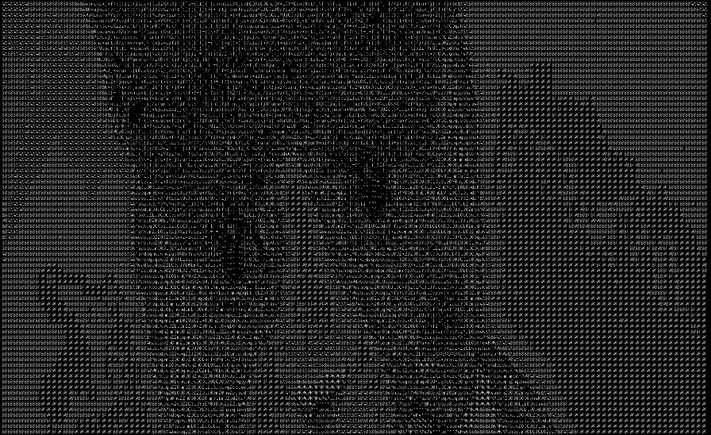

# ASCII Image

Converts an image into its ASCII character representation. Currently works best with image included in this repo

```
cargo run {image_path} {invert}
```

image_path: Image path relative to the repo. Default is "cat2.jpg" found in this repo.
invert: If "invert" is passed as the second parameter it will print the imge with inverted luminocity. Default is non inverted.

```
// This will print an inverted image based on cat2.jpg
cargo run cat2.jpg invert
```

# Input


# Output

